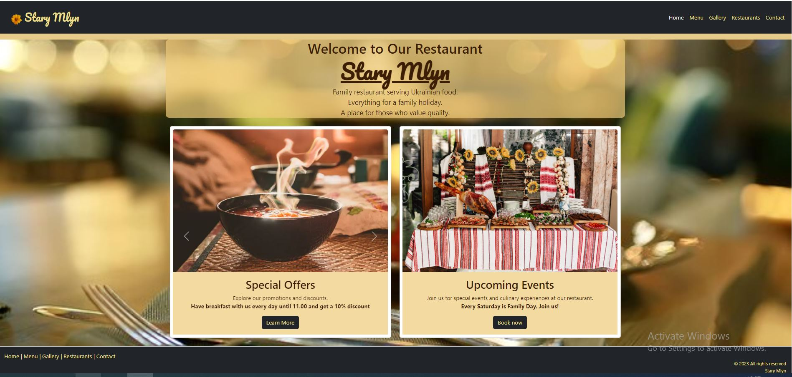
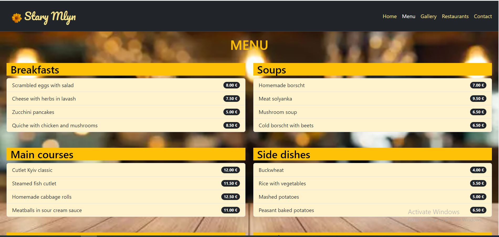
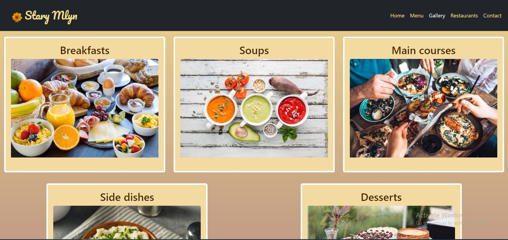
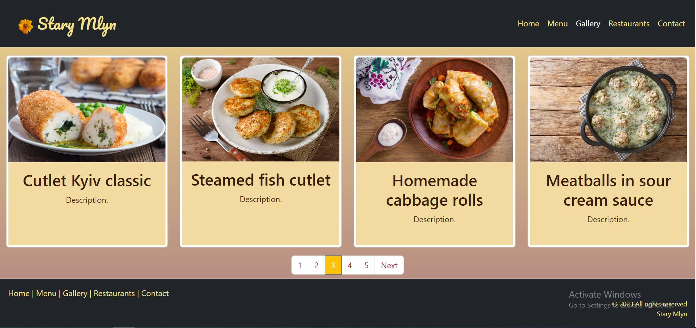
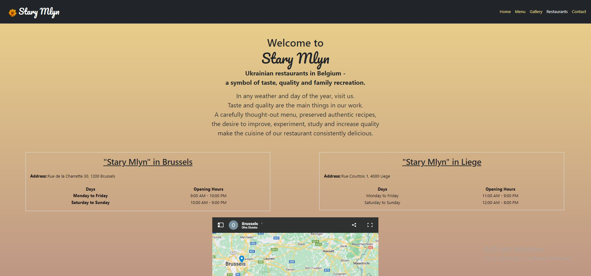
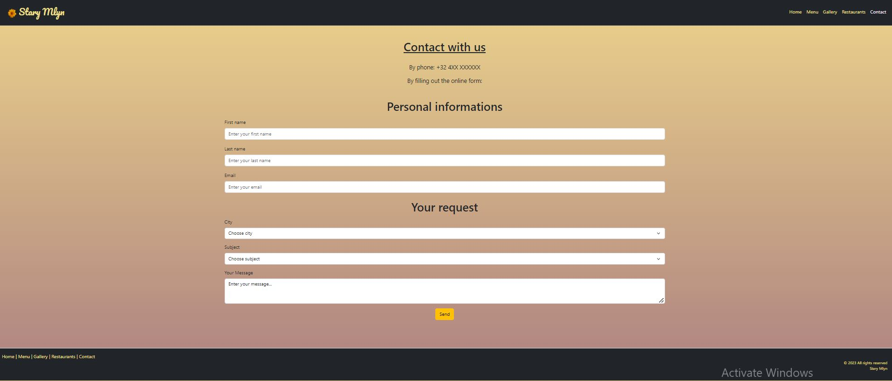

# Site Web du Restaurant "STARY MLYN"
Lien : https://olhasl.github.io/restaurant-css-framework/

Ce projet est un site Web pour le restaurant fictif "Stary Mlyn". C'est une plateforme en ligne destinée aux clients et aux amateurs de bonne cuisine. Il présente le menu, les horaires d'ouverture, l'emplacement et d'autres informations utiles sur le restaurant.

## Date et lieu
Du 3 au 10 octobre 2023, dans le cadre du projet de formation BeCode

## Fonctionnalités

- **Page d'accueil :** Informations sur le restaurant en général, ainsi que sur les événements spéciaux, les soirées à thème et les promotions.
- **Menu :** Menu diversifié comprenant plats principaux, boissons, desserts, etc.
- **Galerie :** Une opportunité de voir des photos de tous les plats du restaurant.
- **Restaurants :** Informations sur l'emplacement du restaurant, indiquant l'adresse avec la possibilité de trouver le restaurant sur la carte. Horaires d'ouverture du restaurant.
- **Contact :** Possibilité de réserver en ligne, de passer commande, de laisser des avis et suggestions, etc.

## Technologies Utilisées

- HTML5, CSS3 et JavaScript pour le frontend
- Framework Bootstrap pour le design réactif
- GitHub, Git

## Captures d'écran

*Page d'accueil du site*

*Extrait du menu en ligne*

*Photos du menu*

*Exemples de photos culinaires*

*Informations sur l'adresse et les horaires*

*Page de contact du resraurant*

## Ressources utilisées
- [github](https://github.com/becodeorg/Swartz-8/blob/main/1.The-Field/10.Bootstrap/restaurant.adoc)
- [bootstrap](https://getbootstrap.com/)
- [w3schools](https://www.w3schools.com/bootstrap5/)
- [README](https://medium.com/becode/comment-faire-un-readme-sur-github-cc11f3df606a)
- [pixabay](https://pixabay.com)
- [istockphoto](https://www.istockphoto.com)
- [freepik](https://fr.freepik.com)
- [unsplash](https://unsplash.com)

## Auteurs

***Olha SLUTSKA (apprenante chez BeCode)***   
+ email : olya.slutskaya@gmail.com    
+ GitHub : https://github.com/olhasl

&copy; 2023 Tous droits réservés